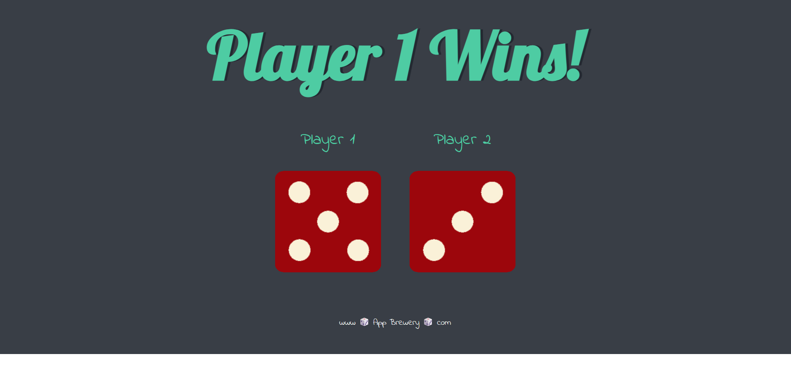
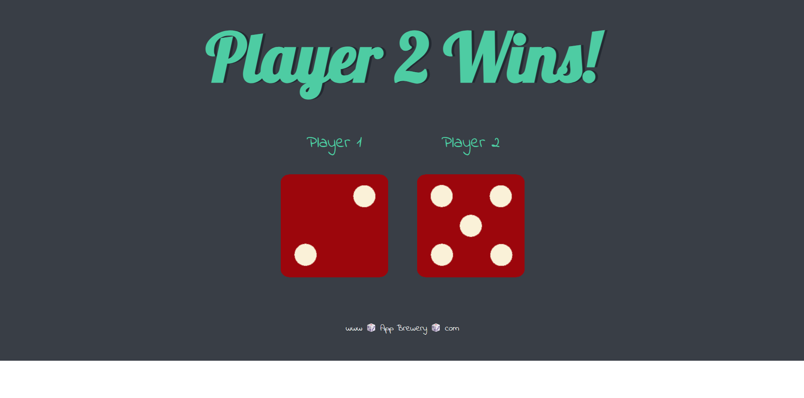
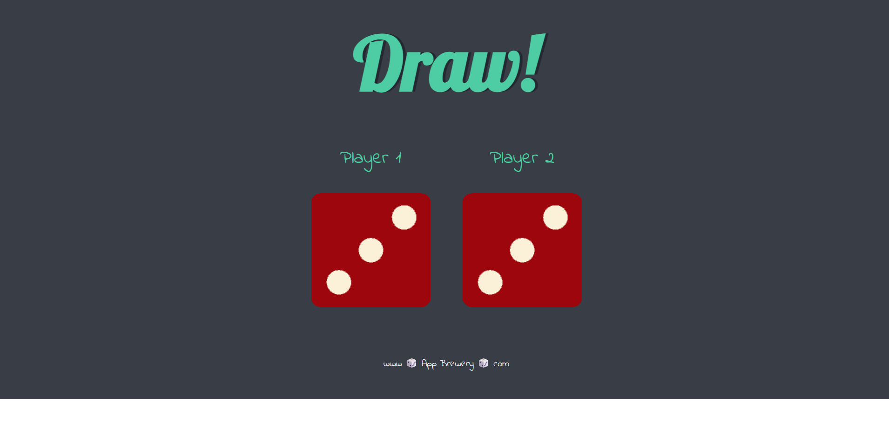

# Dicee Game 🎲

A simple, interactive web-based dice game built using HTML, CSS, and Vanilla JavaScript. The game logic uses JavaScript DOM manipulation to simulate rolling two dice, compare their values, and immediately declare a winner upon reloading the webpage.

## 🚀 Features
* **Dynamic Logic:** Generates random dice values (1 to 6) dynamically upon every page refresh.
* **DOM Manipulation:** Seamlessly updates HTML `src` and `innerHTML` properties at runtime without third-party frameworks.
* **Responsive Styling:** Centered container grid featuring elegant typography imports from Google Fonts (`Lobster` and `Indie Flower`).

---

## 🛠️ Technologies Used
* **HTML5:** Semantic markup structure containing layout buckets for players and graphical assets.
* **CSS3:** Custom layout system using inline-block alignments, dark palette backgrounds (`#393E46`), typography styling, and dropshadow typography effects.
* **JavaScript (ES6):** Pseudo-random algorithm calculation (`Math.random`) paired with active element selection APIs (`querySelector`, `setAttribute`).

---
## Screenshot






## 📁 Project Structure
The repository contains the following architecture:
```text
├── index.html       # Structural layout definitions and script injection pipelines
├── styles.css       # Visual presentation layer, palette settings, and typography
├── index.js         # Computational logic, state evaluation, and DOM binding
└── images/          # Mandatory asset folder containing graphical textures
    ├── dice1.png
    ├── dice2.png
    ├── dice3.png
    ├── dice4.png
    ├── dice5.png
    └── dice6.png
```
---

## 💡 How the JavaScript Logic Works
The execution pipeline follows a precise, linear lifecycle when the browser compiles the document:
- State Initialization: The program computes two independent pseudo-random variables bounded within a strict numeric spectrum:

$$\text{Result} = \lfloor \text{Math.random()} \times 6 \rfloor + 1$$
- String Interpolation Mapping: The script dynamically generates a file-path string combining the numeric result with the asset template configuration:"images/dice" + randomNumber + ".png"
- Attribute Rerouting: The engine executes target selection queries on .img1 and .img2, using the singular .setAttribute() interface wrapper to bind the newly compiled source path.
- Conditional Branching: An if / else if / else pipeline assesses the winning state hierarchy, rewriting the global <h1> header's inner text to display "Player 1 Wins!", "Player 2 Wins!", or "Draw!".

---

## 🕹️ Getting Started
To execute the game locally, follow these steps:
- Clone or download this repository to your machine.
- Ensure you have an images/ directory containing six dice textures named identically to dice1.png through dice6.png.
- Open index.html directly inside any modern web browser (Google Chrome, Mozilla Firefox, Microsoft Edge, Safari).
- Refresh the page to trigger a new dice roll cycle.

Created as part of The Complete Web Development Bootcamp. 🎲